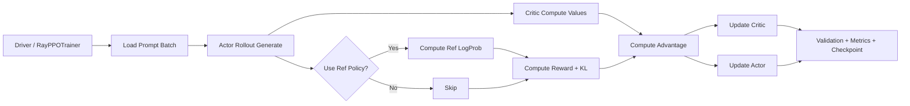

# Architecture Map của verl

## Big Picture

`verl` tổ chức RL training theo kiến trúc `single controller + distributed workers` trên Ray:

1. Controller (driver process) đọc dữ liệu, điều phối vòng train.
2. Worker groups chạy phân tán trên GPU cho các role:
   - Actor/Rollout
   - Critic
   - Ref Policy (khi cần KL)
   - Reward Model (optional)
3. Dữ liệu đi qua các bước generate -> score -> advantage -> update actor/critic.

## Entry points quan trọng

- `verl/trainer/main_ppo.py`
  - `main()` nhận config Hydra.
  - `run_ppo()` khởi tạo Ray, tạo `TaskRunner`.
  - `TaskRunner.run()` build tokenizer/dataset/sampler/trainer và chạy `fit()`.
- `verl/trainer/ppo/ray_trainer.py`
  - `RayPPOTrainer` chứa vòng lặp RL chính.

## Resource & role mapping

Trong `TaskRunner`:

- `add_actor_rollout_worker()`: chọn worker implementation theo backend (`fsdp/fsdp2/megatron/...`) và mode legacy/new engine.
- `add_critic_worker()`: gắn critic worker nếu thuật toán cần critic.
- `add_ref_policy_worker()`: bật ref policy nếu dùng KL loss hoặc KL reward.
- `init_resource_pool_mgr()`: tạo resource pool cho global/reward.

Điểm quan trọng:

- `verl` cho phép colocate nhiều role trong cùng process/GPU để giảm overhead context.
- Có thể tách resource pool riêng cho reward model nếu cần.

## Dataflow training loop

Từ `docs/workers/ray_trainer.rst` + `ray_trainer.py`, luồng tiêu chuẩn:

1. Load batch prompt từ dataloader.
2. Actor rollout generate response.
3. (Optional) Ref policy tính logprob để KL.
4. Critic tính value.
5. Reward stage:
   - Reward model score (optional)
   - Reward function/rule-based score
   - Apply KL penalty (optional)
6. Compute advantage (GAE/GRPO/...)
7. Update critic
8. Update actor
9. Validate + log + checkpoint

## Mermaid sơ đồ

## Ý nghĩa thiết kế

- Tách controller khỏi compute workers giúp mở rộng linh hoạt cho nhiều thuật toán RL khác nhau.
- Unified `DataProto` giảm ma sát khi chuyển dữ liệu giữa role/workers.
- Hybrid architecture cho phép reuse infra training/inference hiện có (FSDP, Megatron, vLLM, SGLang).
