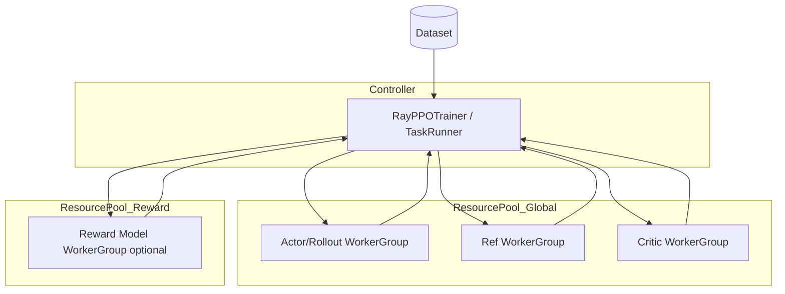
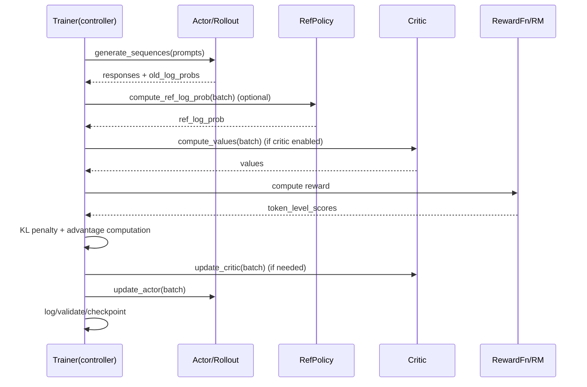

# Kiến trúc `verl` và so sánh với TRL, LLaMA-Factory, Axolotl

## 1. `verl` được xây dựng như thế nào

`verl` dùng kiến trúc `single controller + distributed worker groups`:

- Controller: process điều phối toàn bộ RL dataflow.
- Workers: actor/rollout/ref/critic/reward chạy trên Ray, gắn với resource pools.
- Model engine abstraction: FSDP, Megatron, VeOmni, và rollout engines (vLLM/SGLang/TRTLLM).

### Sơ đồ hệ thống

### Dataflow training loop

## 2. Điểm khác so với Hugging Face TRL

Nguồn đối chiếu:

- TRL index: https://huggingface.co/docs/trl/en/index

Khác biệt chính:

1. `verl` thiên về hệ thống phân tán quy mô lớn (Ray workers, colocated roles, resource pool).
2. TRL thiên về trainer-centric API trong ecosystem Transformers.
3. `verl` tách training engine và rollout engine ngay từ kiến trúc cốt lõi.
4. TRL có độ phủ thuật toán preference/offline rộng hơn ở mức trainer API (DPO/KTO/ORPO/...).

Khi nào chọn:

- Chọn `verl` nếu mục tiêu là RL training scale-out, rollout-heavy, multi-turn tool-calling phức tạp.
- Chọn TRL nếu cần iteration nhanh trong stack HuggingFace, hoặc trainer-level experimentation.

## 3. Điểm khác so với LLaMA-Factory

Nguồn đối chiếu:

- https://llamafactory.readthedocs.io/en/latest/
- https://llamafactory.readthedocs.io/en/latest/advanced/arguments.html

Bản chất:

- LLaMA-Factory là unified training product (CLI/WebUI), hỗ trợ nhiều stage.
- `verl` là RL framework-level infra cho dataflow phân tán và engine orchestration.

Khác biệt:

1. LLaMA-Factory tối ưu DX (CLI/WebUI, stage-centric configs).
2. `verl` tối ưu runtime orchestration và rollout throughput.
3. LLaMA-Factory cho RLHF dựa nhiều vào stack HF/TRL; `verl` có worker runtime riêng.

## 4. Điểm khác so với Axolotl

Nguồn đối chiếu:

- https://docs.axolotl.ai/docs/rlhf.html

Theo docs Axolotl RLHF:

- RLHF là beta.
- Axolotl wrap implementations từ TRL.

Khác biệt:

1. Axolotl là orchestration/config layer cho training workflows.
2. `verl` là RL runtime framework chuyên dụng, nhất là training-rollout decoupling.
3. `verl` có kiến trúc role-based worker APIs phù hợp custom dataflow sâu.

## 5. Matrix so sánh nhanh

| Tiêu chí | verl | TRL | LLaMA-Factory | Axolotl |
|---|---|---|---|---|
| Trọng tâm | Distributed RL runtime | Trainer library | Unified finetune platform | Config-driven finetune platform |
| Kiến trúc rollout/training tách biệt | Native | Tùy trainer/setup | Phụ thuộc backend | Chủ yếu qua TRL wrappers |
| Scale-out RL production | Rất mạnh | Trung bình-mạnh | Trung bình | Trung bình |
| WebUI | Không trọng tâm | Không | Có | Có (qua ecosystem workflows) |
| Độ “hackable” ở dataflow nội bộ | Cao | Trung bình | Trung bình | Trung bình |

## 6. Kết luận kiến trúc

`verl` không đơn thuần là “một trainer”, mà là “hệ điều hành runtime” cho RL post-training của LLM, nơi controller lập trình dataflow và workers thực thi theo role, tách rời training với inference engines để đạt hiệu năng và linh hoạt cao.
