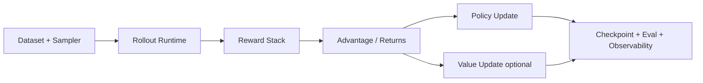

# Blueprint: Một framework RL training cho LLM cần kiến trúc gì?

## 1. Mục tiêu thiết kế

Một framework RL cho LLM cần đồng thời đạt:

1. Thuật toán đúng (objective + estimator + optimization stable).
2. Hệ thống mạnh (distributed, throughput, memory).
3. Khả năng quan sát và debug (metrics, trace, replay, checkpoint).
4. Khả năng mở rộng (new algorithm, new rollout engine, new reward backend).

## 2. Khối kiến trúc bắt buộc

### A. Data layer

- Format messages/tool traces.
- Length control and truncation policy.
- Curriculum or grouped sampling.

### B. Rollout runtime

- High-throughput generation.
- Async execution for environment/tool waits.
- Per-token logging (logprob, mask, trace).

### C. Reward stack

- Rule-based + model-based reward composition.
- Penalties (KL, length, cost).
- Multi-objective aggregation.

### D. Advantage/returns

- GAE/GRPO/RLOO/GPG/... pluggable.
- Grouping semantics rõ ràng.

### E/F. Optimization

- Actor loss family + clipping and regularization.
- Critic optional theo estimator.

### G. Ops layer

- Resume deterministic.
- Profiler hooks.
- Validation and failure diagnostics.

## 3. Kiến trúc runtime nên có

1. Controller điều phối step-level workflow.
2. Role-based workers: actor/rollout/ref/critic/rm.
3. Resource manager để placement linh hoạt.
4. Unified data protocol giữa stages.

## 4. Chiến lược mở rộng thuật toán

Đừng hardcode một algorithm thành một monolith.

Nên tách:

- `adv_estimator` registry.
- `policy_loss` registry.
- `reward_manager` registry.
- config schema rõ ràng.

Đây chính là hướng `verl` áp dụng trong `core_algos.py`.

## 5. Các failure mode kiến trúc cần chặn

1. Training-inference mismatch không được đo -> collapse khó chẩn đoán.
2. Không lưu metadata rollout -> không replay/debug được.
3. Coupling quá chặt giữa algorithm và backend -> khó thêm model/engine.
4. Bỏ qua token-level masks -> loss sai trên padding/EOS.

## 6. Năng lực cần có cho bài toán tool-calling

- Multi-turn state machine.
- Tool schema injection nhất quán với template.
- Async environment interactions.
- Reward decomposition theo outcome + tool quality + safety.

## 7. Checklist framework maturity

1. Có benchmark chuẩn và reproducibility protocol.
2. Có unit + integration tests cho estimators/losses.
3. Có config sanity checks bắt lỗi sớm.
4. Có timeline profiler + memory profiler hooks.
5. Có cookbook cho single node đến multinode.
