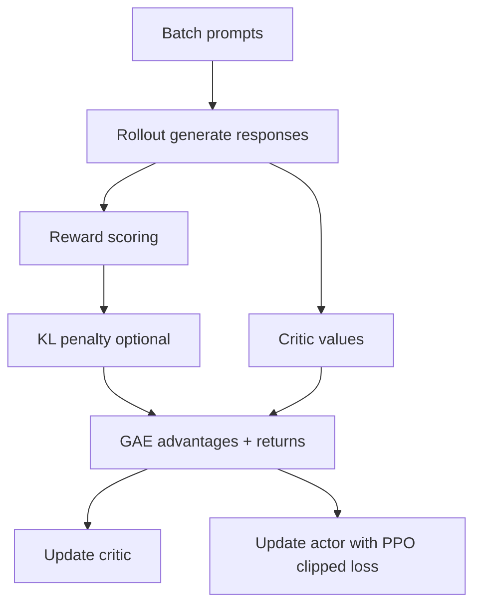

# PPO trong `verl`: phân tích giải thuật từ mã nguồn

Nguồn code chính:

- `verl/trainer/main_ppo.py`
- `verl/trainer/ppo/ray_trainer.py`
- `verl/trainer/ppo/core_algos.py`
- `verl/workers/actor/dp_actor.py`

## 1. Mục tiêu tối ưu

Trong PPO, ta tối ưu policy mới sao cho:

1. Cải thiện reward kỳ vọng.
2. Không đi quá xa policy cũ trong một step (clipping/KL).

Dạng surrogate cơ bản:

- Ratio: `r_t = exp(logπ_new - logπ_old)`
- Objective token-wise: `min(r_t A_t, clip(r_t, 1-ε, 1+ε) A_t)`

`verl` hiện thực ở `compute_policy_loss_vanilla` trong `core_algos.py`.

## 2. Dataflow PPO trong `verl`

## 3. GAE trong mã nguồn

`compute_gae_advantage_return`:

- Duyệt ngược thời gian token.
- `delta_t = r_t + gamma * V_{t+1} - V_t`
- `A_t = delta_t + gamma * lam * A_{t+1}`
- Mask theo `response_mask` để bỏ padding/EOS tail.

Cuối cùng `advantages` được whiten theo mask.

## 4. Actor loss trong mã nguồn

`dp_actor.py` gọi `get_policy_loss_fn(loss_mode)`.

Mặc định `loss_mode=vanilla`:

1. Tính `log_prob` mới từ actor hiện tại.
2. Lấy `old_log_prob` từ rollout hoặc detach tùy mode.
3. Tính `pg_loss` bằng PPO clipping.
4. Cộng entropy regularization nếu bật.
5. Cộng KL loss nếu `use_kl_loss=True`.

## 5. KL control: 2 cách

1. KL trong reward: `algorithm.use_kl_in_reward=True`
   - `token_reward = score - beta * KL`
   - `beta` có thể fixed/adaptive (`KLControlConfig`).
2. KL trong actor loss: `actor.use_kl_loss=True`

Không nên bật cả hai mà không có lý do rõ, vì dễ over-regularize.

## 6. Critic update

Critic học value target từ returns.

Các knobs quan trọng:

- `critic.cliprange_value`
- `critic.ppo_epochs`
- `critic.ppo_micro_batch_size_per_gpu`

Critic yếu sẽ làm advantage noisy -> actor update bất ổn.

## 7. Vai trò của batch hierarchy

- `train_batch_size`: prompts rollout.
- `ppo_mini_batch_size`: split để update nhiều mini-batches.
- `ppo_micro_batch_size_per_gpu`: split nhỏ theo VRAM.

Trong code, mini-batch và micro-batch được split rõ ở `update_policy`.

## 8. Tại sao PPO thường ổn định hơn PG thuần

1. Clipping tránh update step quá lớn.
2. Critic giảm variance của gradient estimator.
3. KL/entropy giúp tránh collapse sớm.

## 9. Mapping công thức -> tensor trong `verl`

- `A_t` -> `data.batch["advantages"]`
- `r_t` từ `log_prob` và `old_log_prob`
- mask -> `response_mask`
- token rewards -> `token_level_rewards`

## 10. Checklist debug PPO

1. `actor/pg_clipfrac` luôn gần 0 hoặc luôn cao bất thường.
2. `actor/ppo_kl` tăng đột ngột.
3. `critic/vf_loss` diverge.
4. reward mean tăng nhưng validation task score không tăng.
