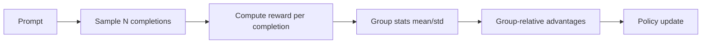

# GRPO trong `verl`: phân tích giải thuật từ mã nguồn

Nguồn chính:

- `verl/trainer/ppo/core_algos.py` (GRPO estimators)
- `verl/trainer/ppo/ray_trainer.py`
- examples trong `examples/grpo_trainer` và `examples/sglang_multiturn`

## 1. Trực giác GRPO

GRPO bỏ nhu cầu critic nặng bằng cách dùng baseline theo nhóm sample của cùng prompt.

Mỗi prompt lấy `n` completions (`rollout.n > 1`).

Reward từng completion được so sánh tương đối trong nhóm đó.

## 2. Công thức trong `verl`

Trong `compute_grpo_outcome_advantage`:

1. `score_i = sum(token_level_rewards_i)`
2. Gom theo group id (`index`, thường là uid prompt).
3. Tính mean/std theo group.
4. Advantage scalar:
   - Chuẩn GRPO: `(score_i - mean_g) / (std_g + eps)`
   - Dr.GRPO style: chỉ trừ mean nếu tắt normalize.
5. Broadcast scalar lên toàn bộ response tokens bằng `response_mask`.

Đây là outcome-level advantage.

## 3. Các biến thể GRPO trong code

`core_algos.py` có:

- `grpo`
- `grpo_vectorized`
- `grpo_passk`

`grpo_passk` chỉ thưởng completion tốt nhất theo margin top1-top2 trong group.

## 4. Luồng GRPO trong trainer

## 5. Tại sao GRPO hợp lý cho reasoning/tool-calling

1. Không cần critic lớn -> giảm chi phí.
2. So sánh tương đối trong nhóm giúp học ranking hành vi.
3. Khớp với các task có outcome reward sparse.

## 6. Chi phí ẩn

GRPO cần nhiều rollout hơn (n completions/prompt).

Nên bottleneck thường nằm ở rollout engine chứ không phải backward.

## 7. Các knob then chốt

1. `actor_rollout_ref.rollout.n`.
2. `algorithm.norm_adv_by_std_in_grpo`.
3. `actor.use_kl_loss` + `kl_loss_coef`.
4. `rollout.gpu_memory_utilization`, TP/DP rollout.

## 8. Failure modes

1. Group size nhỏ hoặc reward gần đồng nhất -> advantage gần 0.
2. Reward function lỗi -> model học hành vi exploit tool call format.
3. rollout.n quá cao nhưng quality reward thấp -> tốn compute mà không tăng signal.

## 9. So sánh ngắn với PPO-GAE

- PPO-GAE: critic-based, token-level TD estimator.
- GRPO: group-relative outcome estimator, critic thường không cần.

Không có estimator “tốt nhất” chung; phụ thuộc data/reward/task.
