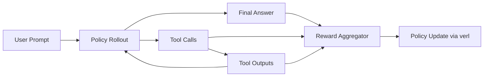

# 01 - Problem Framing & System Design

## 1. Bài toán cần giải

Bạn có một agent cần:

1. Nhận yêu cầu người dùng.
2. Lập kế hoạch theo nhiều lượt (multi-turn).
3. Gọi tool đúng chuẩn và dùng kết quả tool để tiến tới lời giải cuối.

Mục tiêu train: tối ưu policy để **tăng task success** đồng thời **giảm tool-call sai/thừa**.

## 2. System boundary

- Policy model: LLM cần train.
- Environment: tool runtime (search, calculator, DB/API wrappers...).
- Evaluator: reward function + offline benchmark.

## 3. Luồng tổng quan

## 4. Thiết kế agent contract

Trước khi train, đóng băng contract sau:

- Chat format (roles, tags, delimiters).
- Tool schema (name, args, return schema).
- Error semantics (tool timeout, invalid args, parse fail).

Nếu contract không ổn định, reward sẽ nhiễu và model học sai hành vi.

## 5. Done Criteria

- Có problem statement đo được bằng metric.
- Có tool schema versioned.
- Có 1 task suite đại diện cho use case thực tế.
